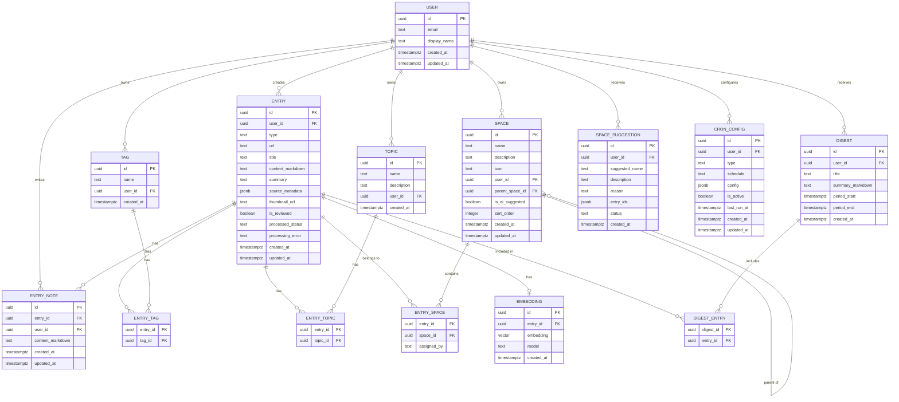
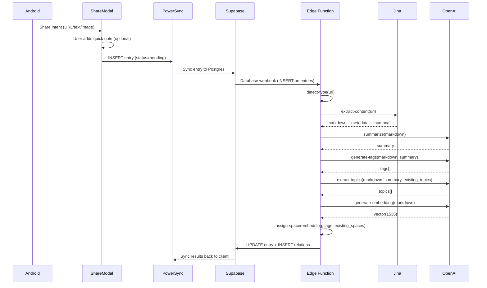
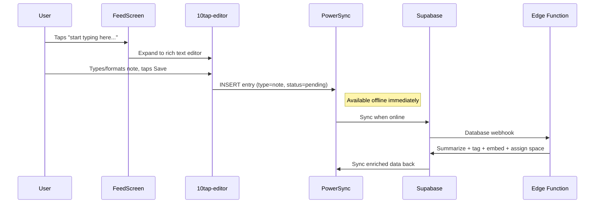
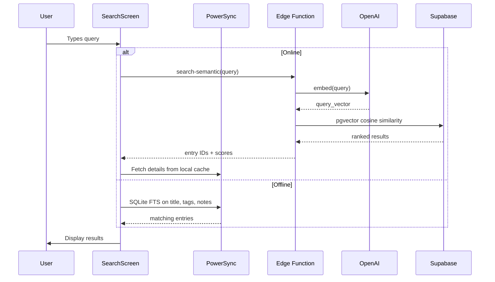
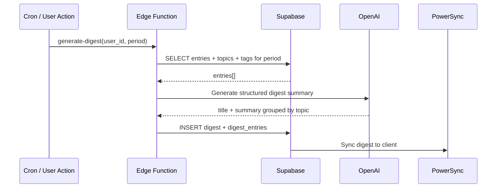
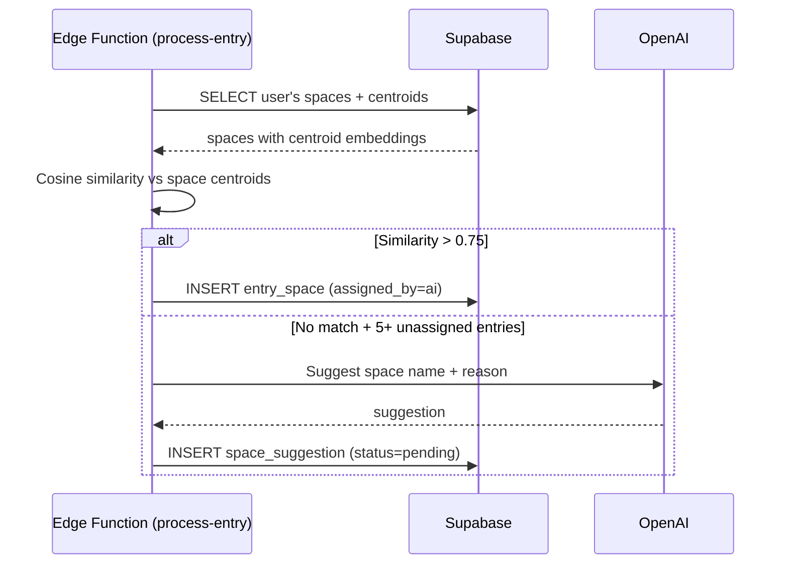
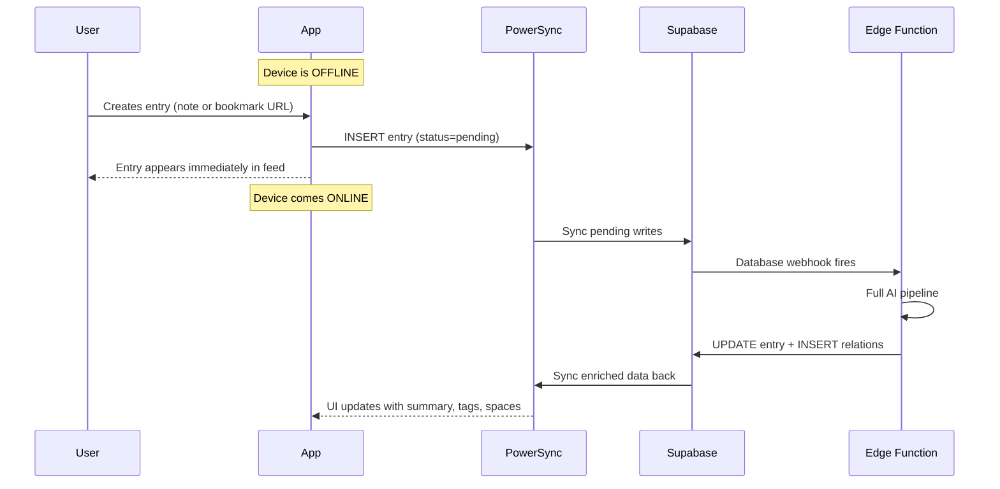

# Architecture — MyMemory

## System overview

```
+----------------------------------------------------------------------+
|                         EXPO APP (Android)                           |
|                                                                      |
|  +------------------+  +------------------+  +--------------------+  |
|  | Expo Router      |  | Zustand + MMKV   |  | TanStack Query     |  |
|  | (tabs, screens)  |  | (UI state)       |  | (server state)     |  |
|  +--------+---------+  +--------+---------+  +---------+----------+  |
|           |                     |                      |             |
|  +--------+---------------------+----------------------+----------+  |
|  |                    DATA LAYER (lib/data/)                       |  |
|  |  PowerSync SQLite <---> Supabase Client <---> TanStack Query   |  |
|  +--------+-------------------+-------------------+---------------+  |
|           |                   |                   |                   |
|  +--------+--------+  +------+------+  +---------+---------+        |
|  | expo-share-      |  | expo-secure|  | 10tap-editor      |        |
|  | intent           |  | -store     |  | (rich text notes)  |        |
|  +------------------+  +-----------+  +-------------------+        |
+----------------------------------------------------------------------+
           |                   |                   |
           |     HTTPS/WSS     |                   |
           v                   v                   v
+----------------------------------------------------------------------+
|                         SUPABASE CLOUD                               |
|                                                                      |
|  +------------------+  +------------------+  +--------------------+  |
|  | Auth             |  | Postgres         |  | Edge Functions     |  |
|  | (email+password) |  | + pgvector       |  | (AI pipeline)      |  |
|  |                  |  | + RLS policies   |  |                    |  |
|  +------------------+  +------------------+  +----+---------------+  |
|                                                    |                 |
|  +------------------+  +------------------+        |                 |
|  | Realtime         |  | Storage          |        |                 |
|  | (PowerSync sync) |  | (thumbnails)     |        |                 |
|  +------------------+  +------------------+        |                 |
+----------------------------------------------------------------------+
                                                     |
                              +----------------------+----------------------+
                              |                      |                      |
                              v                      v                      v
                     +--------+-------+   +----------+-------+   +---------+------+
                     | OpenAI API     |   | Jina Reader API  |   | PowerSync      |
                     | (GPT-4o-mini,  |   | (content         |   | Service        |
                     |  embeddings)   |   |  extraction)     |   | (sync engine)  |
                     +----------------+   +------------------+   +----------------+
```

**Data flow summary:**

1. **Write path:** User saves entry (share intent or manual) -> PowerSync SQLite (instant local write) -> PowerSync syncs to Supabase Postgres -> Database webhook triggers Edge Function -> AI pipeline processes entry -> results sync back via PowerSync
2. **Read path:** PowerSync SQLite serves all reads locally. Full `content_markdown` is lazy-loaded from Supabase on demand and cached in SQLite.
3. **Search path:** Offline uses SQLite FTS on title/tags/notes. Online uses Supabase RPC calling pgvector cosine similarity.
4. **AI path:** All AI runs server-side in Supabase Edge Functions. Client never calls OpenAI or Jina directly.

---

## Stack

| Layer | Choice | Notes |
|---|---|---|
| Framework | Expo (managed workflow) + Expo Router | Dev client required |
| Language | TypeScript strict | |
| Styling | NativeWind v5 + Tailwind v4 | |
| Animations | React Reanimated 3 + Gesture Handler | |
| Auth | Supabase Auth (email + password) | expo-secure-store for tokens |
| Database (server) | Supabase Postgres + pgvector | Embeddings + semantic search |
| Database (local) | PowerSync + SQLite | Offline-first sync |
| ORM | Drizzle | Schema definition + types |
| AI processing | Vercel AI SDK v6 + OpenAI (GPT-4o-mini, text-embedding-3-small) | Server-side only |
| Content extraction | Jina Reader API | Via Edge Functions |
| Rich text editor | 10tap-editor | Markdown output |
| State (UI) | Zustand + MMKV | Persisted local state |
| State (server) | TanStack Query | For non-synced server data |
| Build/Deploy | EAS Build + EAS Update | |

**Deviations from default stack:**
- PowerSync instead of direct Supabase client for offline-first
- Supabase Edge Functions instead of tRPC+Hono (MVP speed, migration path preserved)
- No Hono layer yet — data layer abstraction (`lib/data/`) is the seam for future tRPC migration

---

## Native considerations

### Dev client required

These packages need a custom dev client (not Expo Go):
- `expo-share-intent` — Android intent filters
- `react-native-reanimated` — native module
- `react-native-gesture-handler` — native module
- `@powersync/react-native` — native SQLite
- `10tap-editor` — native WebView-based editor

### expo-share-intent

Config plugin in `app.json`:
```json
{
  "plugins": [
    ["expo-share-intent", {
      "androidIntentFilters": ["text/*", "image/*"],
      "androidMultiIntentFilters": ["text/*", "image/*"]
    }]
  ]
}
```

Share intent handler in root `_layout.tsx` navigates to `share-modal.tsx` when an intent fires.

### expo-secure-store

Custom storage adapter for Supabase client:
```typescript
import * as SecureStore from 'expo-secure-store'
const supabaseStorage = {
  getItem: (key: string) => SecureStore.getItemAsync(key),
  setItem: (key: string, value: string) => SecureStore.setItemAsync(key, value),
  removeItem: (key: string) => SecureStore.deleteItemAsync(key),
}
```

### Config plugins required

| Plugin | Purpose |
|---|---|
| `expo-share-intent` | Android intent filters for share |
| `expo-secure-store` | Keychain/Keystore access |
| `react-native-reanimated` | Babel plugin + native module |
| `@powersync/react-native` | SQLite native module |

---

## Data model

### Entity definitions

**Entry** — core content unit
```typescript
type EntryType = 'article' | 'image' | 'video' | 'note' | 'bookmark' | 'pdf' | 'tweet'
type ProcessedStatus = 'pending' | 'processing' | 'done' | 'failed'

type Entry = {
  id: string                // uuid, PK
  user_id: string           // uuid, FK to auth.users
  type: EntryType
  url: string | null        // null for manual notes
  title: string
  content_markdown: string | null  // full extracted content, lazy-loaded on client
  summary: string | null    // AI-generated TLDR
  source_metadata: Record<string, unknown> | null  // JSON: author, publish_date, site_name, etc.
  thumbnail_url: string | null
  is_reviewed: boolean      // default false
  processed_status: ProcessedStatus
  processing_error: string | null
  created_at: string
  updated_at: string
}
```

**Tag** + **EntryTag**
```typescript
type Tag = {
  id: string        // uuid
  name: string      // unique per user, lowercase
  user_id: string
  created_at: string
}

type EntryTag = {
  entry_id: string
  tag_id: string
}
```

**Topic** + **EntryTopic**
```typescript
type Topic = {
  id: string
  name: string
  description: string | null
  user_id: string
  created_at: string
}

type EntryTopic = {
  entry_id: string
  topic_id: string
}
```

**Space** + **EntrySpace**
```typescript
type Space = {
  id: string
  name: string
  description: string | null
  icon: string | null           // emoji or icon name
  user_id: string
  parent_space_id: string | null  // for subspaces
  is_ai_suggested: boolean
  sort_order: number
  created_at: string
  updated_at: string
}

type EntrySpace = {
  entry_id: string
  space_id: string
  assigned_by: 'user' | 'ai'
}
```

**EntryNote**
```typescript
type EntryNote = {
  id: string
  entry_id: string
  user_id: string
  content_markdown: string
  created_at: string
  updated_at: string
}
```

**Embedding** — server-side only, not synced to client
```typescript
type Embedding = {
  id: string
  entry_id: string         // FK, unique
  embedding: number[]      // vector(1536) — text-embedding-3-small
  model: string
  created_at: string
}
```

**Digest** + **DigestEntry**
```typescript
type Digest = {
  id: string
  user_id: string
  title: string
  summary_markdown: string
  period_start: string     // timestamptz
  period_end: string       // timestamptz
  created_at: string
}

type DigestEntry = {
  digest_id: string
  entry_id: string
}
```

**SpaceSuggestion**
```typescript
type SuggestionStatus = 'pending' | 'accepted' | 'dismissed'

type SpaceSuggestion = {
  id: string
  user_id: string
  suggested_name: string
  description: string | null
  reason: string           // AI explanation
  entry_ids: string[]      // JSON array of entry UUIDs
  status: SuggestionStatus
  created_at: string
}
```

**CronConfig**
```typescript
type CronType = 'auto_digest' | 'space_clustering'

type CronConfig = {
  id: string
  user_id: string
  type: CronType
  schedule: string         // cron expression
  config: Record<string, unknown>  // JSON: { period_days: 7, ... }
  is_active: boolean
  last_run_at: string | null
  created_at: string
  updated_at: string
}
```

### Mermaid ER diagram



---

## Key data flows

### Share intent -> entry creation -> AI processing



### Quick note creation from feed input bar



### Semantic search



### Digest generation



### Space auto-categorization



### Offline entry creation -> sync -> AI processing



---

## API surface

### Supabase Edge Functions

| Edge Function | Purpose | Future tRPC Router |
|---|---|---|
| `process-entry` | Full AI pipeline (extract, summarize, tag, embed, assign space) | `ai.processEntry` |
| `search-semantic` | Generate query embedding + pgvector search | `search.semantic` |
| `generate-digest` | Create digest for time period | `digest.generate` |
| `suggest-spaces` | Cluster unassigned entries, suggest new spaces | `space.suggestClustering` |
| `re-process-entry` | Re-run AI pipeline on failed entry | `ai.reprocess` |

**Edge Function signatures:**
```typescript
// process-entry — triggered by DB webhook or manual call
{ entry_id: string } -> { success: boolean, error?: string }

// search-semantic
{ query: string, limit?: number, space_id?: string }
-> { results: { entry_id: string, score: number, title: string, summary: string }[] }

// generate-digest
{ period_start: string, period_end: string, title?: string }
-> { digest_id: string }

// suggest-spaces
{ min_cluster_size?: number }
-> { suggestions: SpaceSuggestion[] }

// re-process-entry
{ entry_id: string } -> { success: boolean, error?: string }
```

### Supabase RPC Functions (Postgres)

```sql
-- Semantic search (called by search-semantic Edge Function)
CREATE FUNCTION match_entries(
  query_embedding vector(1536),
  match_threshold float DEFAULT 0.7,
  match_count int DEFAULT 20,
  p_user_id uuid DEFAULT auth.uid()
) RETURNS TABLE (id uuid, title text, summary text, type text, thumbnail_url text, similarity float);

-- Full-text search fallback
CREATE FUNCTION search_entries_text(
  query text,
  p_user_id uuid DEFAULT auth.uid()
) RETURNS TABLE (id uuid, title text, summary text, type text, rank real);

-- Space centroids for auto-categorization
CREATE FUNCTION get_space_centroids(
  p_user_id uuid
) RETURNS TABLE (space_id uuid, centroid vector(1536));
```

### Direct Supabase Client Calls (via Data Layer)

Organized by future tRPC router:
```typescript
// entry.repository.ts
entry.list(filters)        // PowerSync reactive query
entry.getById(id)          // PowerSync + lazy content load
entry.create(data)         // PowerSync INSERT
entry.update(id, data)     // PowerSync UPDATE
entry.delete(id)           // PowerSync DELETE
entry.getContent(id)       // Supabase client (lazy-load content_markdown)

// tag.repository.ts
tag.list()                 // PowerSync
tag.create(name)           // PowerSync (upsert by name)

// space.repository.ts
space.list()               // PowerSync (tree structure)
space.create(data)         // PowerSync
space.update(id, data)     // PowerSync
space.delete(id)           // PowerSync
space.getEntries(id)       // PowerSync (via entry_space)

// note.repository.ts
note.listByEntry(entryId)  // PowerSync
note.create(data)          // PowerSync
note.update(id, data)      // PowerSync
note.delete(id)            // PowerSync

// digest.repository.ts
digest.list()              // PowerSync
digest.getById(id)         // PowerSync + entries

// search.repository.ts
search.semantic(query)     // Supabase Edge Function (online)
search.text(query)         // PowerSync SQLite FTS (offline)

// spaceSuggestion.repository.ts
spaceSuggestion.list()     // PowerSync
spaceSuggestion.accept(id) // PowerSync (creates space + assigns entries)
spaceSuggestion.dismiss(id)// PowerSync

// cronConfig.repository.ts
cronConfig.list()          // PowerSync
cronConfig.upsert(data)    // PowerSync
cronConfig.toggle(id)      // PowerSync
```

---

## AI Tool Registry (Edge Function internals)

### Structure

```
supabase/functions/process-entry/
  index.ts                 # Entry point: validate JWT, orchestrate pipeline
  tools/
    detect-type.ts
    extract-content.ts
    summarize.ts
    generate-tags.ts
    extract-topics.ts
    generate-embedding.ts
    assign-space.ts
  lib/
    openai.ts              # OpenAI client singleton
    jina.ts                # Jina client
    supabase-admin.ts      # Supabase service role client
    types.ts               # Shared types
```

### Tool definitions

**detect-type** — URL pattern matching (youtube.com -> video, twitter.com -> tweet, image extensions -> image, pdf -> pdf). Falls back to OpenAI classification if ambiguous.
```typescript
Input:  { url: string | null, content: string | null }
Output: { type: EntryType, confidence: number }
```

**extract-content** — Calls Jina Reader API (`r.jina.ai/{url}`). Returns markdown + metadata. For images: URL as thumbnail. For videos: thumbnail from OG tags + transcript if available.
```typescript
Input:  { url: string, type: string }
Output: { markdown: string, metadata: SourceMetadata, thumbnail_url: string | null }
```

**summarize** — GPT-4o-mini, system prompt tailored by content type.
```typescript
Input:  { markdown: string, type: string, max_length?: number }
Output: { summary: string }
```

**generate-tags** — GPT-4o-mini with `generateObject` + Zod schema. Reuses existing tags when appropriate.
```typescript
Input:  { markdown: string, summary: string, existing_tags: string[] }
Output: { tags: string[] }  // 3-7 lowercase tags
```

**extract-topics** — Maps to existing topics when possible, creates new ones only when genuinely novel.
```typescript
Input:  { markdown: string, summary: string, existing_topics: Topic[] }
Output: { topics: { name: string, description: string, is_existing: boolean, existing_topic_id?: string }[] }
```

**generate-embedding** — text-embedding-3-small, input truncated to ~8000 tokens.
```typescript
Input:  { text: string }
Output: { embedding: number[], model: string }
```

**assign-space** — Cosine similarity against space centroids. Threshold 0.75 for auto-assignment.
```typescript
Input:  { entry_embedding: number[], tags: string[], topics: string[], existing_spaces: SpaceWithCentroid[] }
Output: { space_id: string | null, confidence: number }
```

### Pipeline orchestration

```typescript
async function processEntry(entryId: string) {
  const entry = await getEntry(entryId)
  await updateStatus(entryId, 'processing')

  try {
    // 1. Detect type (if not already set)
    const type = entry.type ?? (await detectType({ url: entry.url, content: null })).type

    // 2. Extract content (skip for notes)
    let markdown = entry.content_markdown
    let metadata = null, thumbnail = null
    if (entry.url && type !== 'note') {
      const extracted = await extractContent({ url: entry.url, type })
      markdown = extracted.markdown
      metadata = extracted.metadata
      thumbnail = extracted.thumbnail_url
    }

    // 3. Summarize + embed in parallel
    const [summaryResult, embeddingResult] = await Promise.all([
      summarize({ markdown, type }),
      generateEmbedding({ text: `${entry.title} ${markdown}`.slice(0, 8000) }),
    ])

    // 4. Tags + topics in parallel (depend on summary)
    const [existingTags, existingTopics] = await Promise.all([
      getUserTags(entry.user_id),
      getUserTopics(entry.user_id),
    ])
    const [tagsResult, topicsResult] = await Promise.all([
      generateTags({ markdown, summary: summaryResult.summary, existing_tags: existingTags }),
      extractTopics({ markdown, summary: summaryResult.summary, existing_topics: existingTopics }),
    ])

    // 5. Assign space
    const spaces = await getUserSpacesWithCentroids(entry.user_id)
    const spaceResult = await assignSpace({
      entry_embedding: embeddingResult.embedding,
      tags: tagsResult.tags,
      topics: topicsResult.topics.map(t => t.name),
      existing_spaces: spaces,
    })

    // 6. Persist everything
    await persistResults(entryId, {
      type, content_markdown: markdown, summary: summaryResult.summary,
      source_metadata: metadata, thumbnail_url: thumbnail,
      tags: tagsResult.tags, topics: topicsResult.topics,
      embedding: embeddingResult, space_id: spaceResult.space_id,
    })
    await updateStatus(entryId, 'done')
  } catch (error) {
    await updateStatus(entryId, 'failed', error.message)
  }
}
```

---

## Background jobs

### AI Processing Pipeline
- **Trigger:** Supabase Database Webhook on `INSERT` into `entries`
- **Target:** `process-entry` Edge Function
- **Error handling:** Sets `processed_status = 'failed'` + error message. User can retry from entry detail screen.
- **Idempotency:** Checks status before running — skips if `done` or `processing`

### Space Suggestion Clustering
- **Trigger:** `pg_cron` weekly (or user-configured)
- **Target:** `suggest-spaces` Edge Function
- **Logic:** Clusters unassigned entries by embedding similarity. Suggests new space for clusters of 3+ entries.

### Auto-Digest Generation
- **Trigger:** `pg_cron` checks `cron_configs` hourly
- **Mechanism:** For active configs where `next_run <= now()`, calls `generate-digest` via `pg_net`
- **User config:** Settings screen — frequency (daily/weekly/monthly), day, time

### Failed Entry Retry
- **Trigger:** `pg_cron` every 15 minutes
- **Logic:** Retries entries with `processed_status = 'failed'` up to 3 times

---

## State management

### PowerSync SQLite (synced data)

| Table | Sync Direction | Notes |
|---|---|---|
| `entries` | Bidirectional | **Excludes `content_markdown`** — metadata only |
| `tags` | Bidirectional | |
| `entry_tags` | Bidirectional | |
| `topics` | Read from server | AI-generated |
| `entry_topics` | Read from server | |
| `spaces` | Bidirectional | |
| `entry_spaces` | Bidirectional | |
| `entry_notes` | Bidirectional | |
| `digests` | Read from server | |
| `digest_entries` | Read from server | |
| `space_suggestions` | Read + status write-back | |
| `cron_configs` | Bidirectional | |

Content lazy-loading: when user opens entry detail, `content_markdown` is fetched from Supabase and cached in a local-only `content_cache` table.

### Zustand + MMKV (UI state)

```typescript
type ThemeMode = 'light' | 'dark' | 'system'

type SearchFilters = {
  type: string | null
  spaceId: string | null
  isReviewed: boolean | null
}

type UIStore = {
  activeTab: string
  feedScrollPosition: number
  searchFilters: SearchFilters
  draftNote: string | null
  shareIntentData: ShareData | null
  theme: ThemeMode
}

type AuthStore = {
  session: Session | null
  isAuthenticated: boolean
  isLoading: boolean
}
```

### TanStack Query (server state not in PowerSync)

| Query Key | Purpose |
|---|---|
| `['search', 'semantic', query]` | Semantic search results (online only) |
| `['entry', id, 'content']` | Lazy-loaded `content_markdown` |
| `['digest', 'generate', params]` | Digest generation mutation status |
| `['ai', 'status', entryId]` | AI processing status polling |

---

## EAS Build strategy

### eas.json profiles

| Profile | Use Case | Output |
|---|---|---|
| `development` | Daily dev with dev client | Debug APK |
| `preview` | QA testing | Release APK |
| `production` | Play Store | AAB |

### OTA Updates (EAS Update)

- Check for updates on app launch + background resume (after 30min)
- Use for JS-only changes
- Full rebuild required for: new native modules, config plugin changes, SDK upgrades

---

## Security

### Authentication
- Supabase Auth with email + password
- Tokens stored in `expo-secure-store` (encrypted Android Keystore)
- Auto-refresh via Supabase JS client

### Row Level Security (RLS)

All tables have RLS enabled:
```sql
CREATE POLICY "Users can only access their own data"
  ON entries FOR ALL
  USING (user_id = auth.uid())
  WITH CHECK (user_id = auth.uid());

-- Junction tables: policy via JOIN to parent
CREATE POLICY "Users can manage their entry tags"
  ON entry_tags FOR ALL
  USING (entry_id IN (SELECT id FROM entries WHERE user_id = auth.uid()));
```

### Edge Function Auth
- Every Edge Function validates JWT from `Authorization: Bearer <token>`
- Database webhooks use service role key with shared secret header

### API Key Management

| Secret | Location | Access |
|---|---|---|
| `OPENAI_API_KEY` | Supabase secrets | Edge Functions only |
| `JINA_API_KEY` | Supabase secrets | Edge Functions only |
| `SUPABASE_SERVICE_ROLE_KEY` | Supabase secrets | Edge Functions only |
| `EXPO_PUBLIC_SUPABASE_URL` | EAS build env | Client (public) |
| `EXPO_PUBLIC_SUPABASE_ANON_KEY` | EAS build env | Client (public, safe with RLS) |
| `EXPO_PUBLIC_POWERSYNC_URL` | EAS build env | Client (public) |

OpenAI and Jina keys never touch the client.

---

## Implementation notes

### Folder structure

```
mymemory/
├── src/
│   ├── app/                          # Expo Router
│   │   ├── _layout.tsx               # Root: providers, auth, share intent listener
│   │   ├── +not-found.tsx
│   │   ├── (auth)/
│   │   │   ├── _layout.tsx
│   │   │   ├── login.tsx
│   │   │   └── signup.tsx
│   │   ├── (tabs)/
│   │   │   ├── _layout.tsx           # Custom floating tab bar
│   │   │   ├── index.tsx             # Feed
│   │   │   ├── search.tsx
│   │   │   ├── spaces.tsx
│   │   │   ├── digestion.tsx
│   │   │   └── settings.tsx
│   │   ├── entry/[id].tsx
│   │   ├── space/[id].tsx
│   │   ├── digest/[id].tsx
│   │   └── share-modal.tsx           # Modal for share intent
│   │
│   ├── components/
│   │   ├── ui/                       # Design system (text, button, card, badge, etc.)
│   │   ├── entry/                    # Entry card, detail, TLDR box, tags, notes
│   │   ├── feed/                     # Feed list, input bar, filters
│   │   ├── search/                   # Search bar, results, filters
│   │   ├── space/                    # Space card, list, suggestion card
│   │   ├── digest/                   # Digest card, content, period picker
│   │   ├── settings/                 # Cron config, account
│   │   ├── share/                    # Share form, type selector
│   │   ├── editor/                   # 10tap note editor wrapper
│   │   └── providers/                # Auth, theme, PowerSync, query providers
│   │
│   ├── hooks/                        # useEntries, useSearch, useShareIntent, etc.
│   ├── stores/                       # Zustand (ui.store, auth.store)
│   ├── lib/
│   │   ├── supabase.ts
│   │   ├── powersync.ts
│   │   ├── query-client.ts
│   │   ├── mmkv.ts
│   │   └── data/                     # Repository pattern (future tRPC seam)
│   ├── db/
│   │   ├── schema/                   # Drizzle schemas
│   │   ├── powersync-schema.ts
│   │   └── migrations/
│   ├── theme/                        # Design tokens, theme hook
│   ├── types/
│   └── constants/
│
├── supabase/
│   ├── migrations/                   # Postgres schema + RLS + pgvector + functions
│   └── functions/
│       ├── process-entry/            # AI pipeline with tools/
│       ├── search-semantic/
│       ├── generate-digest/
│       ├── suggest-spaces/
│       ├── re-process-entry/
│       └── _shared/                  # OpenAI, Jina, auth helpers
│
├── assets/                           # Fonts, images, icons
├── global.css
├── app.json
├── eas.json
├── tailwind.config.js
├── drizzle.config.ts
├── tsconfig.json                     # @/* -> src/*
└── .env.example
```

### Build order

**Phase 1 — Foundation:** Bootstrap Expo + NativeWind + Reanimated + dev client, Supabase setup (schema, RLS, pgvector), PowerSync integration, Auth flow

**Phase 2 — Core Data:** Data layer repositories, entry creation (note from feed), feed screen with cards, entry detail screen

**Phase 3 — Share + AI:** Android share intent, AI pipeline Edge Function, Jina content extraction, tag/topic generation, processing status UI

**Phase 4 — Search + Spaces:** Offline text search, online semantic search, spaces CRUD, AI space assignment + suggestions

**Phase 5 — Digestion + Polish:** Digest generation, digest display, cron configuration, floating tab bar animations, typography polish

**Phase 6 — Production:** EAS Build profiles, OTA updates, error handling, Play Store submission

### Constraints and gotchas

- PowerSync excludes `content_markdown` from sync — always lazy-load via Supabase client
- Share intent requires dev client build for testing — cannot test in Expo Go
- Edge Function timeout is 60s — pipeline must complete within that window (parallel steps help)
- `pg_cron` requires Supabase Pro plan for custom cron jobs
- Drizzle schema is for types + server migrations only — PowerSync has its own schema format
- 10tap-editor outputs markdown — store as-is, render with a markdown renderer on read
