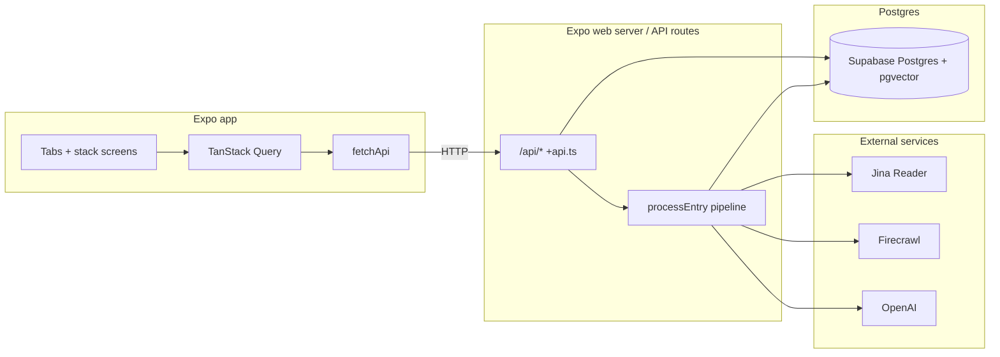
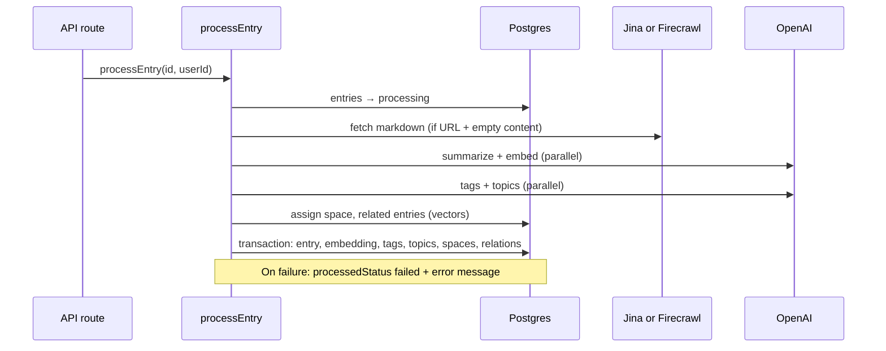

# MyMemory — branch feature reference

This document describes the **memory / feed / AI ingest** work on this branch: navigation, API routes, database shape, ingestion pipeline, URL extraction (Jina vs Firecrawl), client wiring, and operational notes. Use it when onboarding, debugging, or extending the product.

For general app shell and providers, see [`ARCHITECTURE.md`](./ARCHITECTURE.md). For the original phased plan (may differ slightly from implemented paths), see [`AI_PIPELINE_PLAN.md`](./AI_PIPELINE_PLAN.md).

---

## Table of contents

1. [High-level architecture](#1-high-level-architecture)
2. [Environment variables](#2-environment-variables)
3. [Expo Router: screens and stacks](#3-expo-router-screens-and-stacks)
4. [Tab bar and primary flows](#4-tab-bar-and-primary-flows)
5. [HTTP API (Expo API routes)](#5-http-api-expo-api-routes)
6. [Client: `fetchApi`, base URL, contracts](#6-client-fetchapi-base-url-contracts)
7. [Database (Drizzle + Postgres + pgvector)](#7-database-drizzle--postgres--pgvector)
8. [Ingest pipeline](#8-ingest-pipeline)
9. [URL extraction: Jina Reader vs Firecrawl (Medium)](#9-url-extraction-jina-reader-vs-firecrawl-medium)
10. [Embeddings and long documents](#10-embeddings-and-long-documents)
11. [Supabase auth storage (native, web, SSR)](#11-supabase-auth-storage-native-web-ssr)
12. [Database URL handling (Metro vs API)](#12-database-url-handling-metro-vs-api)
13. [Security and production gaps](#13-security-and-production-gaps)
14. [Extension checklist](#14-extension-checklist)

---

## 1. High-level architecture



**Boundaries**

- **`src/app/**`** (except `api/`): UI only; keep screens thin.
- **`src/app/api/**`**: Server-only handlers; may import `@/db` and `@/modules/ai/*`.
- **`src/db/**`**: Drizzle schema and DB client — **do not import from route components** that ship to the native bundle without understanding the implications; the project rule is **no `src/db` in Expo UI** — API routes and server code use it.
- **`src/lib/api/*`**: Shared Zod contracts and `fetchApi` used by hooks on the client.

---

## 2. Environment variables

Documented in [`.env.example`](../.env.example). Summary:

| Variable | Where used | Purpose |
|----------|------------|---------|
| `EXPO_PUBLIC_SUPABASE_URL` | Client | Supabase project URL |
| `EXPO_PUBLIC_SUPABASE_KEY` | Client | Supabase anon (public) key |
| `DATABASE_URL` | Server (API routes, scripts) | Postgres connection string for Drizzle (`postgres` package) |
| `OPENAI_API_KEY` | Server | OpenAI for summarize, tags, topics, embeddings |
| `JINA_API_KEY` | Server | Jina Reader for generic URL → markdown |
| `FIRECRAWL_API_KEY` | Server | Firecrawl scrape for Medium-class URLs |
| `FIRECRAWL_MEDIUM_COOKIE` | Server | Optional `Cookie` header for Medium member content |
| `FIRECRAWL_MEDIUM_PROFILE` | Server | Optional Firecrawl browser profile name (persistent login) |
| `FIRECRAWL_MEDIUM_HEADERS_JSON` | Server | Optional JSON object of extra request headers |
| `FIRECRAWL_MEDIUM_EXTRA_HOSTS` | Server | Comma-separated extra hostnames treated as Medium |
| `FIRECRAWL_API_URL` | Server | Optional full scrape endpoint URL (default Firecrawl v2 scrape) |

**Web + API routes:** `app.json` sets `"expo.web.output": "server"` so API routes run with the Expo web server. Native clients call the Metro host for `/api/...` via `getApiBaseUrl()` (see [§6](#6-client-fetchapi-base-url-contracts)).

---

## 3. Expo Router: screens and stacks

| Path | Role |
|------|------|
| `app/index.tsx` | Auth gate → `(tabs)` or `(auth)` |
| `app/(tabs)/_layout.tsx` | Five tabs + custom `FloatingTabBar` |
| `app/(tabs)/index.tsx` | Feed: list entries, add URL |
| `app/(tabs)/search.tsx` | Search tab (scaffold) |
| `app/(tabs)/spaces.tsx` | Spaces tab |
| `app/(tabs)/digestion.tsx` | Digestion tab (scaffold) |
| `app/(tabs)/settings.tsx` | Settings |
| `app/entry/[id].tsx` | Entry detail (stack; not inside tabs) |
| `app/space/[id].tsx` | Space detail |
| `app/digest/[id].tsx` | Digest detail |
| `app/api/**/+api.ts` | Server routes (see [§5](#5-http-api-expo-api-routes)) |

Entry detail lives outside the tab navigator so it can use a standard stack header and full-width content. Deep linking uses paths like `/entry/<uuid>`.

---

## 4. Tab bar and primary flows

**`FloatingTabBar`** (`src/components/floating-tab-bar.tsx`) renders the bottom tab UI for HeroUI/Uniwind.

**Feed (`(tabs)/index.tsx`)**

- Loads entries with `useEntries()` → `GET /api/entries`.
- Creates entries with `useCreateEntry()` → `POST /api/entries` with `{ url, title, type, content }`.
- On success, the server creates a row with `processedStatus: 'pending'` and kicks off **async** `processEntry` (see [§8](#8-ingest-pipeline)).
- UI should surface `processedStatus` / errors via `EntryCard` / `ProcessingStatus` where wired.

**Hooks** (TanStack Query)

| Hook | File | Query keys / behavior |
|------|------|----------------------|
| `useEntries` | `src/hooks/use-entries.ts` | `["entries"]` |
| `useEntryById` | same | `["entry", id]`; `enabled` when `id` is present |
| `useCreateEntry` | same | invalidates `["entries"]` |
| `useIngest` | `src/hooks/use-ingest.ts` | `POST /api/ingest`; invalidates entries + single entry |
| `useSpaces` / `useCreateSpace` | `src/hooks/use-spaces.ts` | `["spaces"]` |

---

## 5. HTTP API (Expo API routes)

All JSON responses intended for the app follow the shape validated by `apiResponseSchema` in `src/lib/api/contracts.ts`:

```ts
{ success: boolean; data?: T; error?: string }
```

### `GET/POST /api/entries`

**File:** `src/app/api/entries+api.ts`

- **`GET`**: Lists entries for the authenticated user (see [§13](#13-security-and-production-gaps) for current auth stub).
- **`POST`**: Body `{ url?, title?, type?, content? }`. Inserts `entries` row, returns it. Triggers **`processEntry`** in a **dynamic import** (fire-and-forget) so the HTTP response is not blocked by AI/DB work.

### `GET /api/entries/[id]`

**File:** `src/app/api/entries/[id]+api.ts`

- **`GET`**: Returns one entry by `id` for the user, or **404** `{ success: false, error }`.

Expo Router passes route params as the second argument: `GET(request, { id })`.

### `POST /api/ingest`

**File:** `src/app/api/ingest+api.ts`

- Body: `{ entryId: string (uuid) }`.
- Runs **`processEntry(entryId, userId)` synchronously** and returns the updated entry row. Use this to **retry** failed processing or to process without relying on the fire-and-forget path from `POST /api/entries`.

### `GET/POST /api/spaces`

**File:** `src/app/api/spaces+api.ts`

- **`GET`**: User’s spaces.
- **`POST`**: Create space `{ name, description }`.

### `POST /api/ai/demo`

**File:** `src/app/api/ai/demo+api.ts`

- Demo chain: extract (Jina **or** Firecrawl for Medium URLs) → summarize → embed (truncated preview in response). Useful for smoke-testing env vars.

### `POST /api/ai/test`

**File:** `src/app/api/ai/test+api.ts`

- Lightweight test route (adjust as needed).

---

## 6. Client: `fetchApi`, base URL, contracts

**`src/lib/api/client.ts`**

- **`getApiBaseUrl()`**  
  - **Web (browser):** `''` → relative `/api/...` on the same origin as the Expo web server.  
  - **Native:** `http://<expo hostUri>:8081` (or localhost fallback) so the device hits the machine running Metro + API.

- **`fetchApi(path, schema, options)`**  
  - Builds URL, sends JSON, parses response, throws `ApiError` on non-OK or `success === false`.  
  - Validates with the provided Zod schema (failures surface as query errors).

**`src/lib/api/contracts.ts`**

- Uses **`drizzle-zod`** `createSchemaFactory({ coerce: { date: true } })` for **select** schemas so **ISO date strings** from JSON coerce to `Date` and validation succeeds. Without this, React Query appeared “stuck” because `parse` failed on the client.

**Authorization header:** the client currently sends a placeholder Bearer token; the server **`requireAuth`** does not validate JWTs yet ([§13](#13-security-and-production-gaps)).

---

## 7. Database (Drizzle + Postgres + pgvector)

**Schema entrypoint:** `src/db/schema/index.ts` re-exports domain tables.

| Area | File(s) | Notes |
|------|---------|--------|
| Enums | `enums.ts` | Entry type, processed status, etc. |
| Entries | `entries.ts` | Core memory row: `url`, `content`, `summary`, `processedStatus`, `error`, … |
| Embeddings | `embeddings.ts` | `vector(1536)` for `text-embedding-3-small` |
| Spaces | `spaces.ts` | Includes centroid vector + relations (`entrySpaces`, `spaceRelations`) |
| Tags / topics | `tags.ts`, `topics.ts` | Junctions `entryTags`, `entryTopics` |
| Relations | `entry-relations.ts` | Semantic similarity edges between entries |
| Suggestions | `space-suggestions.ts` | When no space matches |
| Digests | `digests.ts` | Digest entities + digest-entry link table |
| Notes | `entry-notes.ts` | Per-entry notes |

**Migrations:** `src/db/migrations/` — use `drizzle-kit` per project conventions.

**pgvector:** enable in Supabase before pushing schema that uses `vector` — run [`scripts/supabase-enable-pgvector.sql`](../scripts/supabase-enable-pgvector.sql) in the SQL editor.

**Client:** `src/db/index.ts` — lazy proxy around Drizzle + `postgres` driver; validates/normalizes `DATABASE_URL`, warns on invalid DSN, falls back to a dev connection string for local bundling (see [§12](#12-database-url-handling-metro-vs-api)).

---

## 8. Ingest pipeline

**Orchestrator:** `src/modules/ai/pipelines/ingest.ts` — **`processEntry(entryId, userId)`**.



**Steps (simplified)**

1. Set entry to **`processing`**, clear `error`.
2. If type is **`url`** and `content` is empty, fetch markdown:
   - **Medium-class URL** + `FIRECRAWL_API_KEY` → Firecrawl (`extractMediumArticleWithFirecrawl`).
   - **Medium-class URL** without Firecrawl key → warning + **Jina** fallback.
   - Otherwise → **Jina** (`extractContentFromUrl`).
3. **Parallel:** `summarizeText(markdown)` and `generateEmbedding(markdown)`.
4. **Parallel:** `generateTags`, `extractTopics` (using markdown + summary).
5. **Parallel:** `assignSpace` (embedding vs space centroids), `findRelatedEntries` (pgvector distance).
6. **Single transaction:** update entry (`content`, `summary`, `done`), insert embedding, tags/topics/spaces/relations/suggestions as applicable.
7. On error: set **`failed`** and store `error.message`.

**Tools directory:** `src/modules/ai/tools/` — one concern per file (`summarize.ts`, `generate-embedding.ts`, `assign-space.ts`, etc.).

---

## 9. URL extraction: Jina Reader vs Firecrawl (Medium)

| Source | Tool | When |
|--------|------|------|
| Generic URLs | `extract-content.ts` | Default: Jina Reader `r.jina.ai/...` with `JINA_API_KEY` |
| Medium-class hosts | `extract-content-medium-firecrawl.ts` | If `isMediumArticleUrl(url)` and `FIRECRAWL_API_KEY` set |

**`isMediumArticleUrl`** (hostname rules)

- `medium.com` or `*.medium.com`
- `*.plainenglish.io` (common Medium publication pattern)
- Plus any host in **`FIRECRAWL_MEDIUM_EXTRA_HOSTS`** (comma-separated)

**Firecrawl request (conceptual)**

- `POST` to v2 scrape URL (overridable via `FIRECRAWL_API_URL`).
- Body includes `formats: ['markdown']`, `onlyMainContent: true`, `maxAge: 0` to reduce stale paywall HTML.
- Optional **`profile`** (persistent browser session on Firecrawl’s side — preferred over pasting cookies into `.env` for long-term maintenance).
- Optional **`headers`** from cookie env or JSON headers.

---

## 10. Embeddings and long documents

**File:** `src/modules/ai/tools/generate-embedding.ts`

OpenAI embedding inputs are limited to **8192 tokens** per request. Long Jina/Firecrawl markdown (many URLs) can exceed that.

**Strategy implemented**

- Split text into chunks of roughly **`(8192 - 512) * 2.5` characters** (conservative tokens/char).
- At most **8 chunks** per entry.
- **One chunk:** single `embed()`.
- **Multiple chunks:** `embedMany()` then **element-wise mean** + **L2 normalization** so stored vectors remain comparable for cosine-style distance in SQL.

---

## 11. Supabase auth storage (native, web, SSR)

**File:** `src/lib/supabase.ts`

- **Native:** `expo-secure-store` for session persistence.
- **Web (browser):** `localStorage` (same key semantics as Supabase client).
- **SSR / Node (no `window`):** storage **no-ops** / `getItem` → `null` so importing the Supabase client during Expo Router **server render** does not call `ExpoSecureStore.default.getValueWithKeyAsync` (which is undefined on Node).

---

## 12. Database URL handling (Metro vs API)

**File:** `src/db/index.ts`

- **`DATABASE_URL`** may be loaded when Metro bundles server code; invalid or missing values should not crash the whole bundler.
- Connection string is **normalized** (trim, strip BOM, strip optional quotes) before `new URL()` validation.
- Invalid DSN → console warning and **dev fallback** connection string; actual API calls may then fail until `.env` is fixed.
- **Tip:** Supabase passwords with `?`, `@`, `#`, `!` often need **URL-encoding** in the URI.

---

## 13. Security and production gaps

This branch is template-oriented. Before production:

1. **`requireAuth`** in API routes returns a **fixed UUID**; replace with JWT verification (e.g. Supabase Auth JWT from `Authorization: Bearer`).
2. **Align `userId`** in DB rows with real `auth.users` ids from verified tokens.
3. **Remove or secure** `demo` / `test` AI routes.
4. **Rate-limit** expensive routes (`/api/entries`, `/api/ingest`, Firecrawl/OpenAI).
5. **Secrets:** never commit `.env`; rotate keys if leaked.
6. **Fire-and-forget ingest** after `POST /api/entries` may not complete on some serverless hosts if the runtime freezes; prefer a queue or synchronous `/api/ingest` for critical paths.

---

## 14. Extension checklist

- [ ] Real **auth** on all `/api/*` routes + RLS policies on Supabase matching `userId`.
- [ ] **Search** tab: wire to pgvector / full-text search API.
- [ ] **Digestion** tab: scheduled digest generation using `digests` schema.
- [ ] **Entry detail:** markdown rendering, `ScrollView`, share actions.
- [ ] **Observability:** structured logs for `processEntry`, metrics on ingest duration/failures.
- [ ] **Tests:** Vitest for `fetchApi` mappers, Zod contracts, and pure helpers.

---

## Related files (quick index)

| Topic | Path |
|------|------|
| Ingest pipeline | `src/modules/ai/pipelines/ingest.ts` |
| Jina extract | `src/modules/ai/tools/extract-content.ts` |
| Firecrawl Medium | `src/modules/ai/tools/extract-content-medium-firecrawl.ts` |
| Embeddings | `src/modules/ai/tools/generate-embedding.ts` |
| API client | `src/lib/api/client.ts` |
| Zod contracts | `src/lib/api/contracts.ts` |
| DB proxy | `src/db/index.ts` |
| Supabase client | `src/lib/supabase.ts` |
| Feed UI | `src/app/(tabs)/index.tsx` |
| Entry detail | `src/app/entry/[id].tsx` |

---

*Last updated to match the `jina-openai-basic-template` branch feature set (Expo SDK 55, Expo Router API routes, Drizzle, TanStack Query).*
