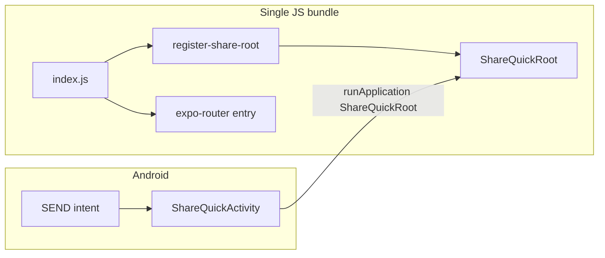

# Android Share Quick

## What it does

When the user shares text or a URL from another app, Android can open a **dedicated translucent activity** instead of cold-starting the full Expo Router tree. A minimal UI creates an entry through the same oRPC + Supabase path as the main app, optionally triggers `ai.ingest`, then finishes the activity.

## Why a separate activity

- **`SEND` / `SEND_MULTIPLE` intent filters** live on `ShareQuickActivity`, not `MainActivity`, so a normal app launch is not conflated with share.
- **Short-lived UX**: translucent overlay, explicit `finish()` when done.
- **Second React root**: same JS bundle, different `AppRegistry` entry (`ShareQuickRoot`).

## Key files

| Piece | Location |
|--------|-----------|
| Custom entry | `apps/mobile/index.js` |
| `AppRegistry` registration | `apps/mobile/src/register-share-root.ts` |
| UI + flow | `apps/mobile/src/features/share/ShareQuickRoot/` |
| Intent → create input | `apps/mobile/src/features/share/utils/mapShareIntentToCreateInput.ts` |
| Config plugin | `apps/mobile/plugins/withAndroidShareQuick.js` |
| Plugin wired | `apps/mobile/app.config.ts` |

The plugin adjusts intent filters, generates Kotlin (`ShareQuickActivity`, native `ShareQuick.finish()`), and registers the package in `MainApplication`.

## Auth and cache

Share Quick expects the user to have signed in **in the main app** (shared secure storage). After `entries.create`, it bumps an MMKV marker and updates TanStack Query so the main feed can resync when the user returns — see [sync-and-cache.md](./sync-and-cache.md).

## How to test (QA)

1. Build a dev client or release binary with the plugin applied (`expo prebuild` / EAS).
2. Sign in in the main app.
3. From another app: **Share → MyMemory**.
4. Expect overlay → create → optional ingest → dismiss.

Unsigned-in users get an error and dismiss — intentional.

## Future iterations

- **More MIME types / files**: extend `mapShareIntentToCreateInput` and native filters; keep mapping in one place.
- **iOS share extension**: different target and entry; reuse mapping + oRPC patterns, not the Android plugin.
- **Smaller main bundle**: optional second Metro entry only for Share Quick (extra CI complexity).
